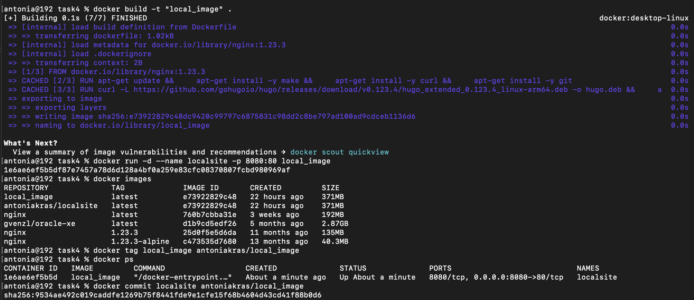
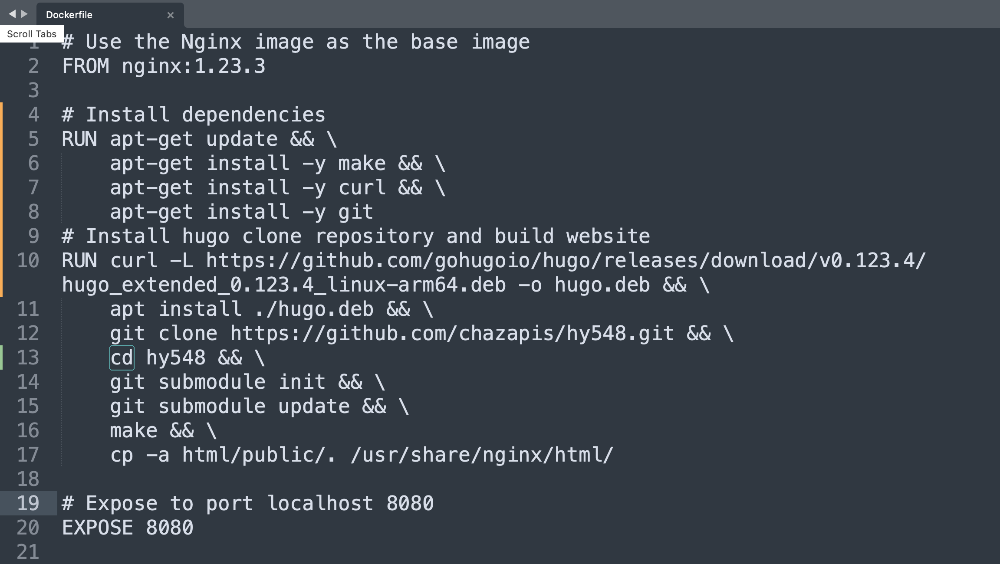
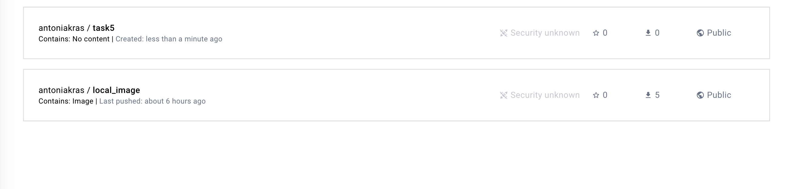
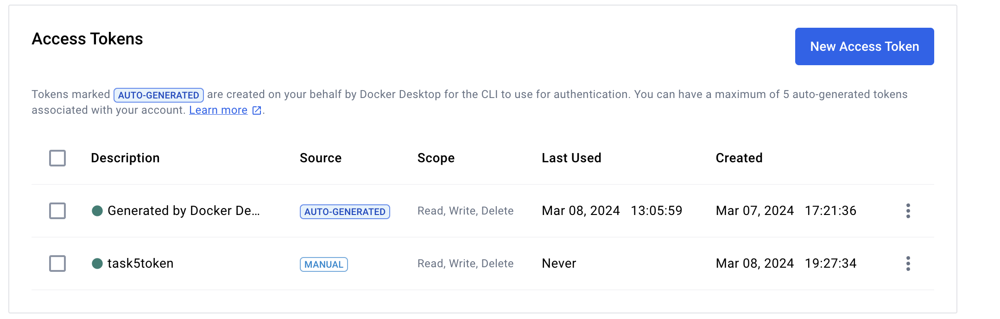
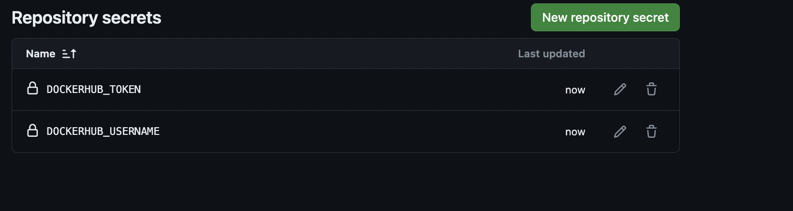
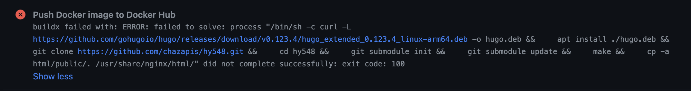

# Project overview
---------------------

Containerized a Django web application using Docker, implemented persistence via volumes, optimized image size, and published it to Docker Hub. Automated builds & deployments using GitHub Actions (CI/CD). Demonstrated Docker networking, container debugging, and multi-instance deployment

## csd4140 | Antonia Krasoudaki

### Task 1

* a - b )

After pulling and downloading locally the images nginx images and running the command docker images, nginx 1.23.3 image is 135MB and bigger than nginx 1.23.3-alpine that's 40.3MB

* c-h )

There are screenshots in the folder task1 for each subtask. The response of the curl is the default nginx webpage.

### Task 2
  There are screenshots in the folder for each subtask and the answer to c is bellow:

## Task 3

After copying the files from the local html folder to the docker container with the command docker cp, localhost now serves the course's webpage.

## Task 4 

*d ) The image size is 371MB, bigger than the base image since dependencies like make , curl, hugo git were installed on top of the base nginx image
therefore adding files and increasing it's size. Additionally the repository was cloned and the html file was copyied effecting the image size as well.

## Task 5

In task 5 all of the correct steps were followed , creating the dockerhub repository :

Generating and assigning the Access token : 

And saving the correct values for secret keys DOCKERHUB_USER and DOCKERHUB_TOKEN:

The yml file seems to have the correct values. There was a problem encountered with the dockerfile although it was working properly on task4.
The issue couldn't be resolved after trying to alter the path, changing the line runs on to mac-os latest instead of ubuntu.
Even after changing the line to the linux-64 bit version of hugo : RUN curl -L -o /usr/local/bin/hugo https://github.com/gohugoio/hugo/releases/download/v0.123.4/hugo_extended_0.123.4_Linux-64bit.deb ,
The same error was printed.

