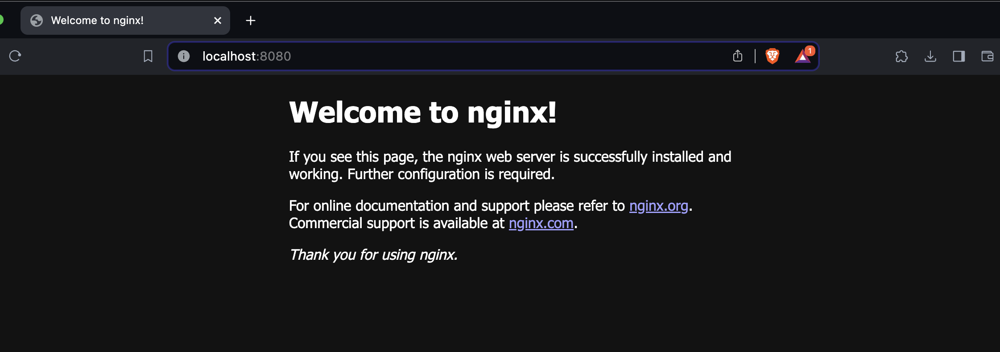
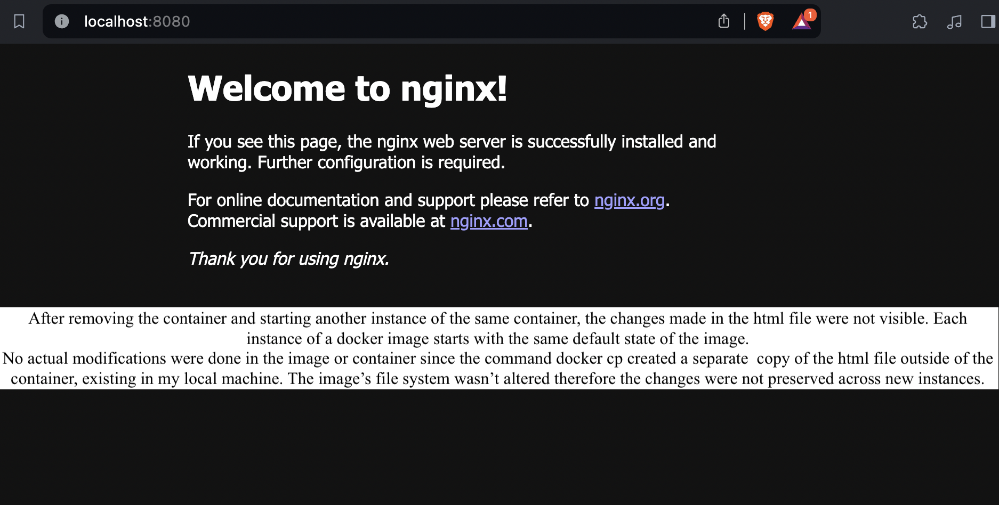
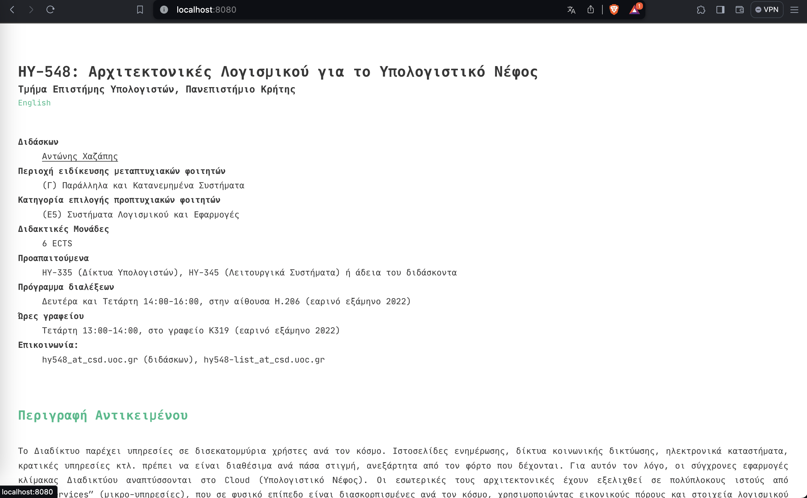

# Assignment 1
---------------------
## csd4140 | Antonia Krasoudaki

### Task 1

* a - b )

After pulling and downloading locally the images nginx images and running the command docker images, nginx 1.23.3 image is 135MB and bigger than nginx 1.23.3-alpine that's 40.3MB

* c-h )

There are screenshots in the folder task1 for each subtask. The response of the curl is the default nginx webpage.

### Task 2
  There are screenshots in the folder for each subtask and the answer to c is bellow:

## Task 3

After copying the files from the local html folder to the docker container with the command docker cp, localhost now serves the course's webpage.

## Task 4 

*d ) The image size is 371MB, bigger than the base image since dependencies like make , curl, hugo git were installed on top of the base nginx image
therefore adding files and increasing it's size. Additionally the repository was cloned and the html file was copyied effecting the image size as well.

## Task 5

